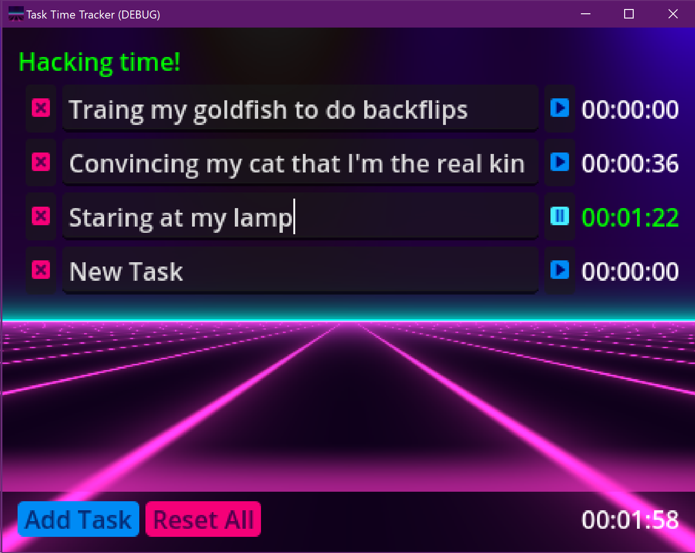

# Task Time Tracker in Redot Engine

A simple tool for tracking time spent on individual tasks. Works fine on Windows and macOS.

## Information

Written in GDScript and [Redot Engine](https://github.com/Redot-Engine/) (I prefer Redot over Godot because the latter is run by weirdos).

## Issues

If you have any suggestions or problems with this program, feel free to open an issue—I’ll be happy to help.

## Contribution

Any help and improvements are more than welcome!

## License

This project is released under the [Unlicense](LICENSE) license.
